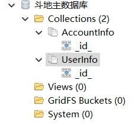

# 环境：

Unity版本2018.4.24f1+VS2019

服务器端：.NET Core 2.2.3

学习ET框架的练手项目，与原版ET5.0框架相比，稍有改动，区别不大。

# 运行步骤：

搭建MongoDB数据库：

------

打包：

1、打开Web资源服务器

2、打开打包工具，配置如下，打包：

------

运行发布版：

1、保持Web资源服务器打开

2、打开\Landlords_Client01\Landlords_Client01\Release\下的Landlords.exe

3、效果如下：

登录：

顶号登录：

房间抢地主：

结算：

总体效果：

